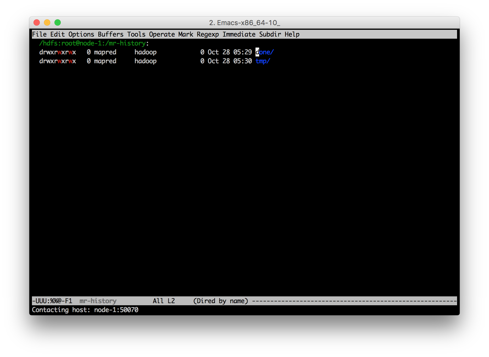

# Tramp-HDFS

[](https://gitter.im/raghavgautam/tramp-hdfs?utm_source=badge&utm_medium=badge&utm_campaign=pr-badge&utm_content=badge)
[](http://melpa.org/#/tramp-hdfs)

Browse HDFS(Hadoop Distributed File System) in Emacs using Tramp.


## Usage
Put this somewhere in your init file. Eg. ~/.emacs or ~/.emacs.d/init.el

    (require 'tramp-hdfs)

It uses hdfs rest api/webhdfs which is supported in hadoop 1 & 2.
The syntax to open file in hdfs is just like opening file over tramp.

    /hdfs:root@node-1:/tmp

Here, root is the user that you want to use, node-1 is the name of the hadoop server.
As a general advice refrain from using superuser accounts like hdfs, hadaoop.

## Supported features:
* Directory browsing
* Opening files
* Deleting files/directories

## Requirements
* The server must support webhdfs

## Installation
* Manually: Download tramp-hdfs.el and add the location to load path.
* Through melpa:
Ensure you have melpa in your package-archives
(see [Melpa Installation](http://melpa.org/#/getting-started)).
Then, M-x package-install [RET] tramp-hdfs. 

## Run inside docker
```bash
docker run -it --rm -v `pwd`:/root/.emacs.d silex/emacs
```

## Run tests
```bash
docker run -it --rm -v `pwd`:/root/.emacs.d silex/emacs --batch -l ert -l /root/.emacs.d/tramp-hdfs.el -l /root/.emacs.d/tramp-hdfs-tests.el -f ert-run-tests-batch-and-exit
```

## Known issues:
* Security is not supported.
* It doesn't support writing to files to hdfs or acls.

## Filing bugs & Feature requests:
Please open bugs at:
https://github.com/raghavgautam/tramp-hdfs

To get tramp-debug logs:

    (setq tramp-verbose 10)
